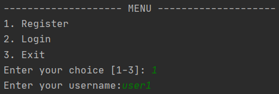
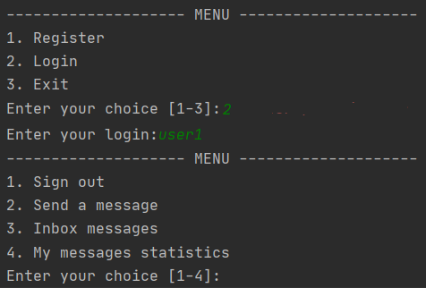
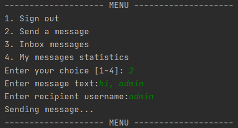
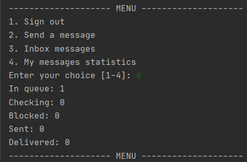
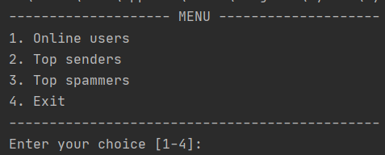
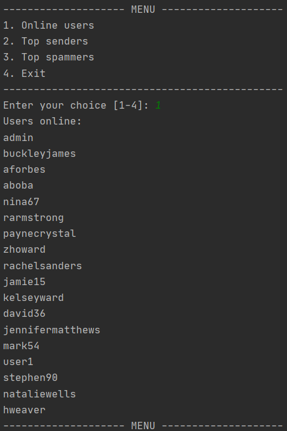
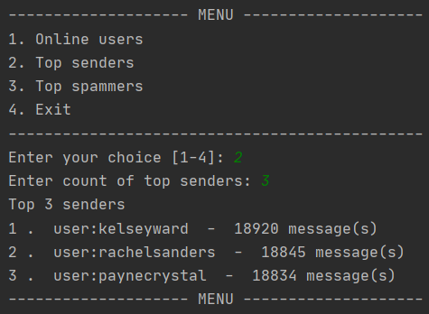
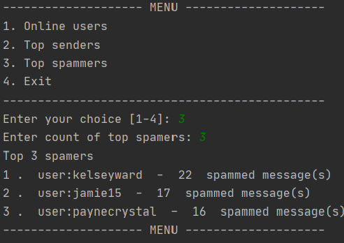

# Лабораторна робота № 2. Практика використання серверу Redis

## Виконав

Длубак Родіон Романович. Группа КП-81

## Звіт

[Посилання на звіт](https://docs.google.com/document/d/1AEdaSD5jEAvMyNPvLGgjy1q-dEBOyFqGKgYkh2zlpK4/edit)

## Структура даних
Повідомлення зберігаються у вигляді Hash таблиці бо вона дозоволяє зберігати ключ та значення. Ключем виступає id повідомлення, значенням - ім'я відправника, отримувача, текст повідомлення. id для кожного нового запису збільшується на одиницю.

Користувачі системи зберігаються за допомогою множини (Set), так як нам не є важливий їх порядок, але є важливою швидкість доступу до них.

Для черги повідмлень було використано LIST, адже ця структура даних зберігає порядок, а операції вставляння в кінець та вилучення з початку займають О(1) часу.

## Приклади роботи програми

